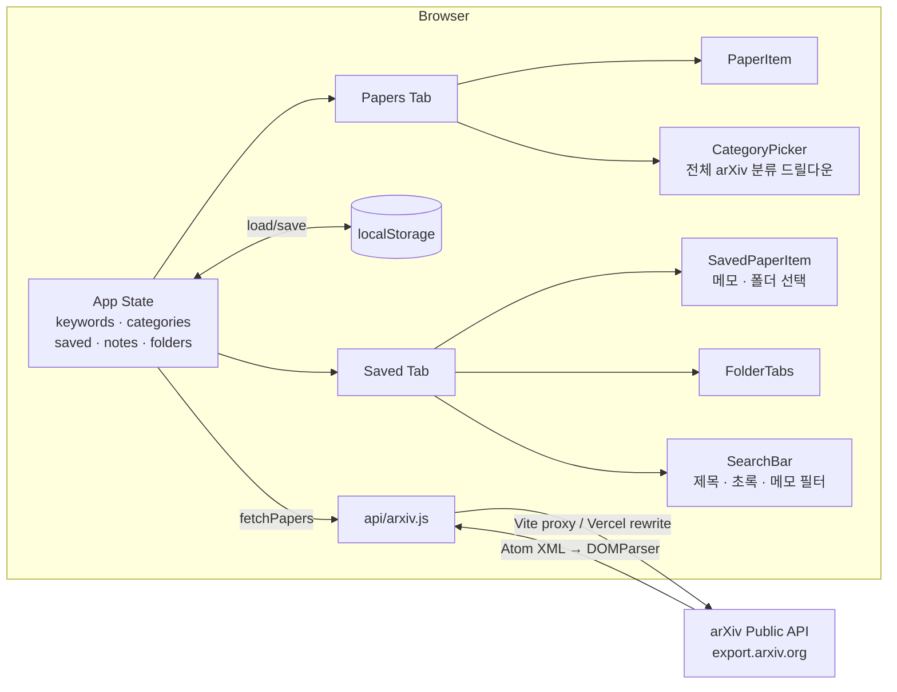

## 구현 결과 (GitHub)

https://github.com/boostcampwm-snu-2026-1/InteractiveResearchHelper-SeonukKim

---

## 배포 URL

https://interactive-research-helper.vercel.app

---

## 아키텍처 다이어그램

---

## Task 관리

GitHub Issues — 기능별 이슈 생성 → 구현 완료 후 close

- #6 feat: arXiv 카테고리 필터 (closed)
- #7 feat: 스타 논문 메모 (closed)
- #8 feat: 스타 논문 폴더 관리 (closed)
- #9 feat: 저장 논문 내 검색 (closed)

https://github.com/boostcampwm-snu-2026-1/InteractiveResearchHelper-SeonukKim/issues?q=is%3Aissue+is%3Aclosed

---

## 개발과정 기록

2주차 회고 Wiki: https://github.com/boostcampwm-snu-2026-1/InteractiveResearchHelper-SeonukKim/wiki/2주차-회고

### Workflow 개선 (1주차 초안 대비)

| 항목 | 1주차 | 2주차 |
|------|-------|-------|
| 기능 단위 관리 | 한 커밋에 전부 | 기능별 GitHub Issue 먼저 등록 → 구현 → close |
| 문서화 | 없음 | Wiki 회고 + 기획서 업데이트, README 정확화 |
| README | Vanilla JS로 잘못 기재 | React 19 + 전체 스택 상세 기재로 수정 |

이슈를 먼저 쓰고 시작하니 "지금 뭘 만들어야 하는지"가 명확해져서 scope creep이 줄었다.

---

## 막혔던 부분과 해결 방식

### 1. arXiv 전체 카테고리 계층 파악

arXiv는 상위 그룹(cs, eess, math…) 아래 하위 카테고리(cs.LG, eess.AS…)가 있고,
quant-ph·hep-\* 처럼 하위 카테고리 없이 단독으로 존재하는 것들도 있다.
초기에 이를 구분하지 않고 설계했다가 드릴다운 UX가 어색해졌다.

**해결:** AI에게 "arXiv 전체 분류 체계를 `{id, name, subs[]}` 형태로 정리해줘. 하위 없는 것은 `subs: []`" 라고 요청해 데이터 파일을 한 번에 생성하고, 컴포넌트에서 `subs.length === 0`이면 바로 추가, 아니면 펼치는 방식으로 분기했다.

### 2. 상태 정합성 — 폴더 삭제·언스타 시 연쇄 처리

폴더 삭제 시 소속 논문의 폴더 배정 해제, 언스타 시 해당 논문의 메모·폴더 동시 삭제가 필요했다.
처음에는 `setSaved` 내부에서 다른 setter를 호출하는 패턴을 썼는데 React에서 권장하지 않는 방식이었다.

**해결:** 현재 `saved` 상태를 동기적으로 읽어 `isSaved` 여부를 판단하고, 조건에 따라 각 setter를 독립적으로 호출하는 방식으로 수정했다.

---

## 다르게 한다면?

- **상태 분리:** 기능이 늘면서 `App.jsx`가 300줄이 넘어졌다. `useReducer`나 커스텀 훅(`useSavedPapers`, `useFolders`)으로 상태 로직을 분리했으면 가독성이 훨씬 나았을 것.
- **컴포넌트 설계 먼저:** 기능 구현 → 컴포넌트 분리 순서로 했는데, 다음엔 컴포넌트 트리를 먼저 그려놓고 들어가면 중간 리팩터링 비용이 줄 것 같다.
- **브랜치 전략 실제 적용:** 이번에도 main에 직접 커밋했는데, 다음 주엔 `feature/*` → `dev` → `main` 흐름을 실제로 써볼 것.
